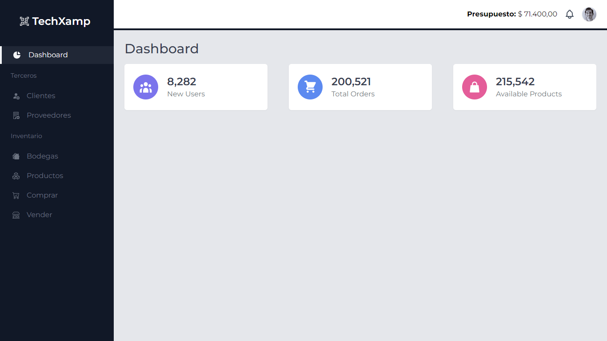

# Sistema de Inventario

Bienvenido al **Sistema de Inventario**, una solución moderna y eficiente construida con Vue.js que te permite gestionar tus productos de manera intuitiva y en tiempo real. Este sistema se conecta a una robusta API RESTful desarrollada en Laravel, asegurando que tengas un control total sobre tu inventario.

## Características

- **Gestión de Productos**: Agrega, edita y elimina productos fácilmente.
- **Interfaz Intuitiva**: Diseñada para ofrecer una experiencia de usuario fluida.
- **Conexión en Tiempo Real**: Actualiza y consulta tu inventario en tiempo real.

## Requisitos

- Node.js (versión recomendada: 14.x o superior)
- npm (gestor de paquetes de Node)

## Instalación

Sigue estos pasos para configurar el proyecto en tu entorno local:

1. **Clona el repositorio**:
   git clone https://github.com/JuanRios-dev/TechXamp.Vue.git
   cd TechXamp.Vue

2. **Instala dependencias**:
    npm install

3. **Inicia el servidor local**
    npm run dev

- **Ahora puedes acceder a la aplicación en tu navegador en**: http://localhost:8080.

Contribuciones
¡Las contribuciones son bienvenidas! Si deseas mejorar el proyecto, siéntete libre de enviar un pull request o abrir un issue.